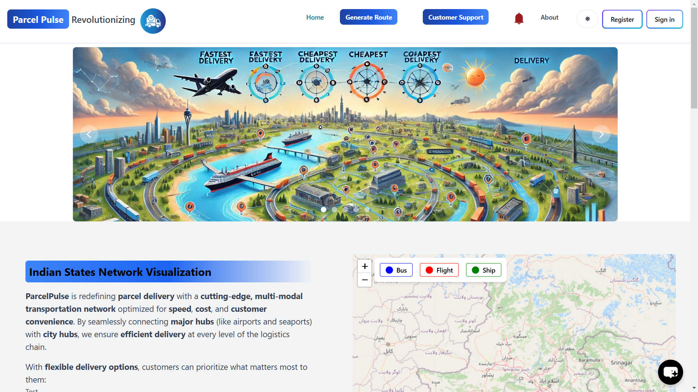

# ParcelPurse

ParcelPurse is an innovative web application designed for seamless Dynamic Mail Transmission, enabling users to efficiently manage and track parcel deliveries through real-time updates. Built with **Node.js** and **ReactJS**, ParcelPurse combines a user-friendly interface with a powerful backend to optimize the mailing process, ensuring accuracy and enhancing overall delivery management.

<table>
  <tr>
    <td></td>
    <td></td>
  </tr>
</table>
<table>
  <tr>
    <td></td>
    <td></td>
  </tr>
</table>

<!-- ## Live Demo

Explore the live version of ParcelPurse: [ParcelPurse Live]() -->

## Table of Contents

- [Features](#features)
- [REST API Endpoints](#rest-api-endpoints)
- [Technologies Used](#technologies-used)
- [Installation](#installation)
- [Environment Variables](#environment-variables)
- [Usage](#usage)

## Features

### Core Features
- Node registration and authentication
  <table>
  <tr>
    <td></td>
    <td></td>
  </tr>
</table>
- Dynamic Mail Transmission Dashboard
  <table>
  <tr>
    <td></td>
    <td></td>
  </tr>
</table>
  <table style="width:100%; text-align:center;">
  <tr>
    <td></td>
    <td></td>
  </tr>
</table>
- Notifications
<table style="width:100%; text-align:center;">
  <tr>
    <td></td>
  </tr>
</table>
- L1/L2 Dashboard
  <table style="width:100%; text-align:center;">
  <tr>
    <td></td>
  </tr>
</table>
<table>
  <tr>
    <td></td>
    <td></td>
  </tr>
</table>

- Profile
  <table style="width:100%; text-align:center;">
  <tr>
    <td></td>
  </tr>
</table>

## REST API Endpoints

### Authentication
- `POST /api/auth/signup`
  - Register a new user.
  
- `POST /api/auth/signin`
  - Authenticate user credentials and start a session.
  
- `POST /api/auth/signin1`
  - Alternate authentication for users (if applicable).
  
- `POST /api/auth/google`
  - Authenticate users via Google OAuth.

### User Management
- `GET /api/user/test`
  - Test the user-related routes (for development/debugging purposes).
  
- `PUT /api/user/update/:userId`
  - Update details of a specific user (requires token verification).
  
- `DELETE /api/user/delete/:userId`
  - Delete a user account (requires token verification).
  
- `POST /api/user/signout`
  - Log the user out and invalidate the session.
  
- `GET /api/user/getusers`
  - Retrieve a list of all users (requires token verification).
  
- `GET /api/user/:userId`
  - Get details of a specific user.

### Parcel Management
- `POST /api/parcel/createNewParcel`
  - Create a new parcel record.
  
- `POST /api/parcel/trackParcel`
  - Track the status of a specific parcel.
  
- `POST /api/parcel/acceptParcel`
  - Mark a parcel as accepted at a node.
  
- `POST /api/parcel/dispatchParcel`
  - Dispatch a parcel from a node.
  
- `POST /api/parcel/makeGroups`
  - Create groups for dynamic parcel batching.
  
- `POST /api/parcel/dispatchGroup`
  - Dispatch a batch of parcels.

### Node Management
- `POST /api/nodes/createNodes`
  - Add or configure a new node in the delivery system.

### Parcel Notifications
- `POST /api/parcelNotification/getAllNotifications`
  - Retrieve all notifications related to parcel activities.

### Bus Booking
- `POST /api/bus/book`
  - Book a bus for parcel transportation.

### Payments
- `POST /api/pay/checkout`
  - Initiate a payment checkout process.
  
- `POST /api/pay/paymentverification`
  - Verify payment status after checkout.

### Notifications
- `GET /api/send/notify-all`
  - Send notifications to all users.

## Technologies Used

- **React.js**: JavaScript library for building dynamic user interfaces.
- **Tailwind CSS**: Utility-first CSS framework for fast UI design.
- **Flowbite**: UI component library built with Tailwind CSS.
- **SweetAlert**: Library for customizable popup alerts.
- **Redux**: State management library for JavaScript apps.
- **Firebase**: Backend-as-a-service for authentication, databases, and more.
- **Leaflet**: JavaScript library for interactive maps.
- **Lucide-react**: Customizable SVG icon library for React.
- **bcrypt**: Library for hashing and securing passwords.
- **JWT**: Standard for securely transmitting information between parties.
- **Nodemailer**: Module for sending emails from Node.js.
- **dotenv**: Loads environment variables from a `.env` file.
- **UUID**: Generates universally unique identifiers.
- **Crypto**: Node.js module for cryptography and secure hashing.
- **Razorpay**: Payment gateway API for processing online payments.
- **Multer**: Middleware for handling file uploads in Node.js.

## Installation

To set up the project locally, follow these steps:

1. **Clone the Repository**:
   ```bash
   git clone https://github.com/Charlie-rk/SIH.git

2. **Navigate to the Project Directory**:

   ```bash
   cd SIH

3. **Install Dependencies: Run the following command to install the necessary packages**:

   ```bash
   npm install

4. **Install Dependencies for frontend**:

   ```bash
   npm install

## Environment Variables

Create a .env file in the root directory and include the following variables:

    CLOUDINARY_CLOUD_NAME=your_cloud_name
    CLOUDINARY_API_KEY=your_api_key
    CLOUDINARY_API_SECRET=your_api_secret
    EMAIL_USER=your_email
    EMAIL_PASS=your_email_password
    ATLASDB_URL=your_mongodb_atlas_connection_string
    SECRET=your_session_secret

## Future Improvements

- **Parcel Tracking with Real-time Updates**: Implement real-time tracking for parcels, providing users with live updates on the status of their shipments.
- **Multi-language Support**: Add support for multiple languages to accommodate users from different regions.
- **Mobile App Integration**: Develop a mobile app for iOS and Android to enable users to manage their parcels and bookings on the go.
- **Referral Program**: Introduce a referral program where users can earn rewards by inviting new users to the platform.
- **Enhanced Security**: Implement features like two-factor authentication (2FA) and encryption for added security during parcel transactions.
- **AI-based Recommendations**: Use AI to recommend parcels or services based on user behavior, location, and preferences.

## Usage
```bash
1. Start the Application: First navigate to the SIH folder
   cd client 
   npm run dev

   cd .. 
   cd api
   node index.js

2. Access the Application: Open your web browser and go to http://localhost:5173 (or the specified port) to access the application.

3. Create an Account: Go to the signup page to create a new account or log in if you already have one.


# SIH-2024-finals
